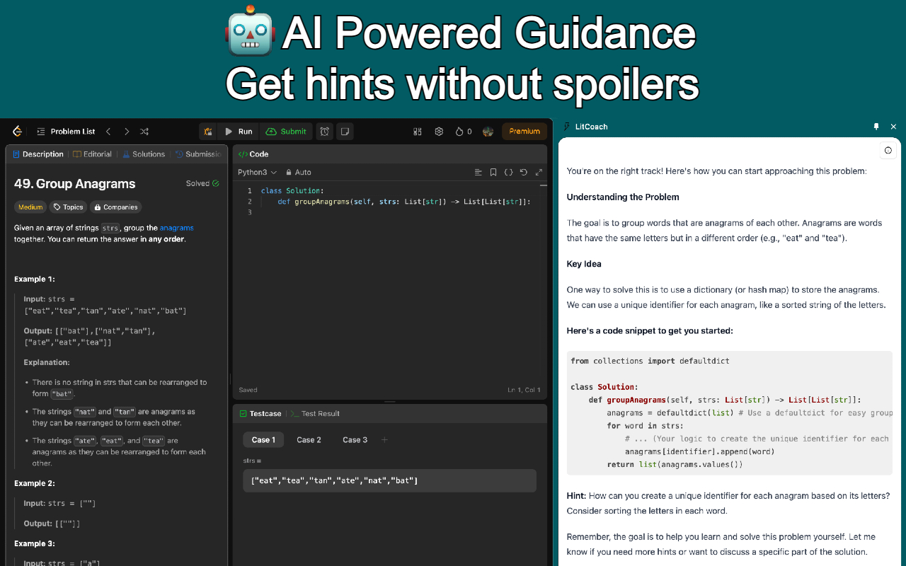
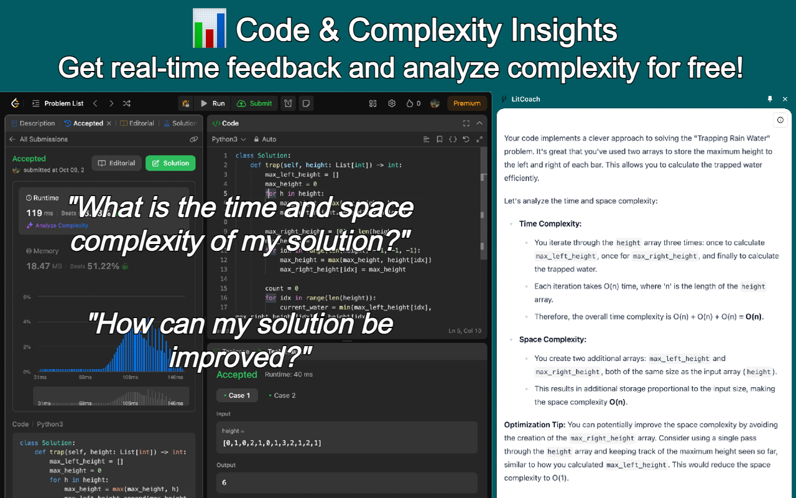
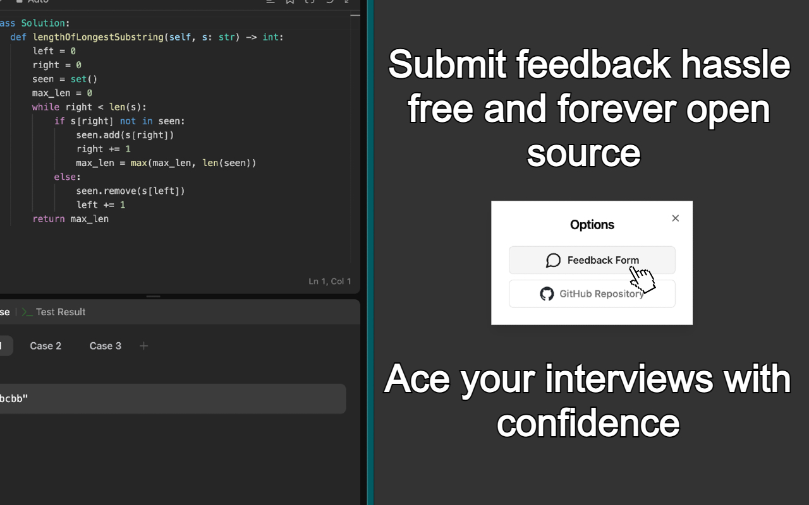

<p align="center">
  
  
  
</p>

[](https://chromewebstore.google.com/detail/litcoach/pbkbbpmpbidfjbcapgplbdogiljdechf?hl=en&authuser=0)

## LitCoach

Chrome extension that uses Google's Gemini 1.5-Flash AI model to provide real-time feedback and hints for LeetCode problems, reducing problem-solving time and improving user productivity.

## Development Setup

### Prerequisites

- Get your API key from [Google AI](https://ai.google.dev/) and add it to the `.env` file:
    ```bash
    VITE_GEMINI_API_KEY='YOUR_API_KEY'
    ```
- Ensure [Node.js](https://nodejs.org/) is installed.

### Installation Steps

1. **Clone the repository**:
    ```bash
    git clone https://github.com/rezabrizi/LitCoach.git
    ```

2. **Navigate to the project directory**:
    ```bash
    cd LitCoach
    ```

3. **Install dependencies**:
    ```bash
    npm install
    ```

4. **Start the development server**:
    ```bash
    npm run dev
    ```

5. **Enable Developer Mode in Chrome**:
    - Go to `chrome://extensions/`.
    - Enable **Developer Mode**.

6. **Load the extension**:
    - Click **Load unpacked**.
    - Select the `dist` folder.

You're now ready to test and develop the extension locally!
