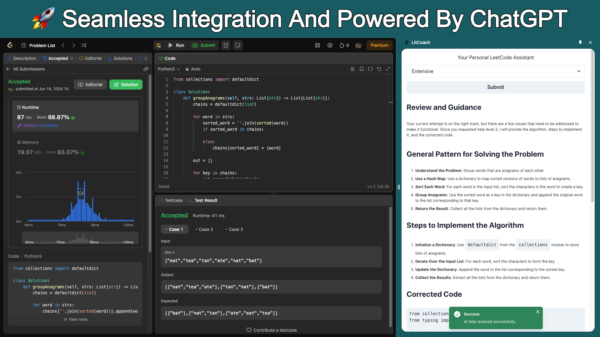
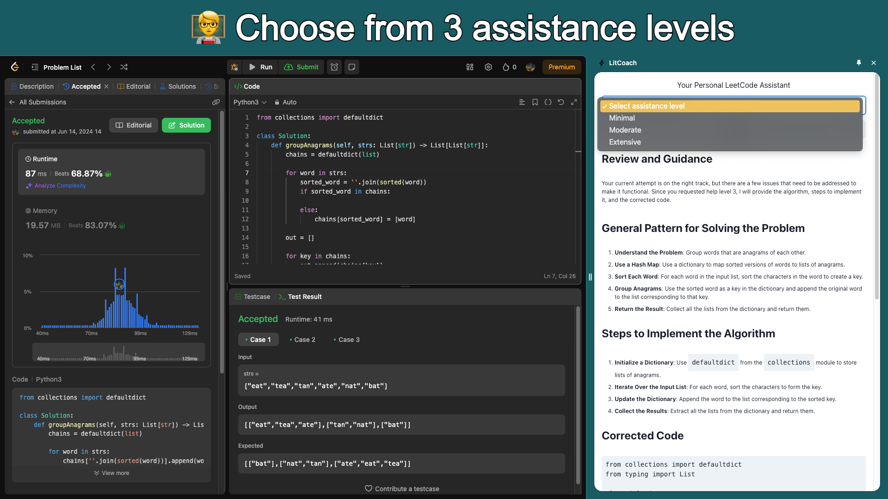

<h1 style="text-align:center; font-size: 3em;">⚡ LitCoach</h1>

LitCoach is an AI-powered Chrome extension designed to provide comprehensive guidance and feedback for LeetCode problems, leveraging the advanced capabilities of ChatGPT. Whether you're preparing for technical interviews or aiming to enhance your problem-solving skills, LitCoach offers tailored advice and insights to help you succeed.

## Backend

[](https://flask.palletsprojects.com/)
[](https://www.openai.com/)
[](https://vercel.com/)

## Frontend

[](https://vitejs.dev/)
[](https://reactjs.org/)
[](https://chakra-ui.com/)
[](https://www.npmjs.com/package/axios/)

## Local Development Instructions

> [!NOTE]  
> This project uses the `concurrently` package to run the server and extension concurrently. Check out the `package.json` file for more details.

**Ensure you have the following software installed on your machine:**

- Node.js
- Python
- Anaconda (optional, for managing virtual environments)

### Steps:

1. **Clone the repository:**

    ```bash
    git clone https://github.com/rezabrizi/LitCoach.git
    ```

2. **Navigate to the project directory:**

    ```bash
    cd LitCoach
    ```

3. **Set up a Python virtual environment:**

    **Using `venv`:**

    ```bash
    # Create a virtual environment
    python -m venv venv

    # Activate the virtual environment
    # On Windows
    venv\Scripts\activate
    # On Unix or MacOS
    source venv/bin/activate
    ```

    **Using `conda`:**

    ```bash
    # Create a conda environment
    conda create --name litcoach-env python=3.8

    # Activate the conda environment
    conda activate litcoach-env
    ```

4. **Install Necessary Dependencies:**

    ```bash
    npm install
    ```
    > [!NOTE]  
    > This command not only installs the Node.js dependencies but also triggers a post-install script that installs the required Python packages.

5. **Start the server and extension concurrently:**

    ```bash
    npm run dev
    ```

6. **Enable Developer Mode in Chrome:**

    - Navigate to `chrome://extensions/`.
    - Enable Developer Mode.

7. **Load the extension:**

    - Click "Load unpacked".
    - Select the `dist` folder.
    - The extension is now ready for seamless testing and development.

Please feel free to open an issue or submit a pull request if you have any suggestions or feedback.




