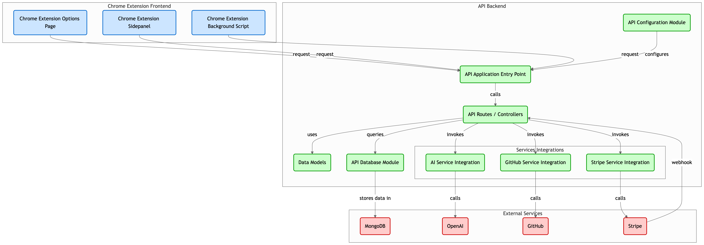

# LitCoach

LitCoach is a Chrome extension that gives you real-time feedback on LeetCode problems and automatically syncs your solutions to GitHub—making it easy to track your progress and showcase activity while you prep for interviews.

[](https://chromewebstore.google.com/detail/profstats-ut-dallas/doilmgfedjlpepeaolcfpdmkehecdaff)

  
_Image from gitdiagram.com_

## Local Development

Ensure you have the following installed and set up before proceeding:

-   [Node.js](https://nodejs.org/)

-   [Python 3.12+](https://www.python.org/downloads/)

-   [Poetry](https://python-poetry.org/docs/#installation)

-   [Stripe CLI](https://stripe.com/docs/stripe-cli)

-   [MongoDB Atlas](https://www.mongodb.com/atlas/database)

-   [OpenAI API Key](https://platform.openai.com/account/api-keys)

-   [GitHub OAuth App](https://docs.github.com/en/apps/oauth-apps/building-oauth-apps/creating-an-oauth-app)

-   [Stripe Account](https://dashboard.stripe.com/register)

> [!IMPORTANT]
> When creating the **GitHub OAuth App**, set the **Authorization callback URL** to:  
> `https://pbkbbpmpbidfjbcapgplbdogiljdechf.chromiumapp.org`
> This is required for authentication to work inside the Chrome Extension.

1. Clone the repository:

    ```bash
    git clone https://github.com/rezabrizi/LitCoach.git
    cd LitCoach
    ```

2. Copy the environment config file:

    ```bash
    cp .env.example .env
    ```

3. Open `.env` and fill in all the required values:

    ```env
    # Frontend
    VITE_API_URL=http://127.0.0.1:8000
    VITE_GITHUB_CLIENT_ID=<your_github_client_id>

    # Backend
    MONGO_DB_URI=<your_mongo_connection_string>
    OPENAI_KEY=<your_openai_api_key>
    GITHUB_CLIENT_ID=<your_github_client_id>
    GITHUB_CLIENT_SECRET=<your_github_client_secret>
    STRIPE_API_KEY=<your_stripe_secret_key>
    STRIPE_WEBHOOK_SECRET=<your_stripe_webhook_secret>
    ```

> [!NOTE]
> Need help finding these values? Use the links in the **Prerequisites** section above.

3. Create a Python virtual environment (using Python 3.12):

    ```bash
    python3.12 -m venv venv
    source venv/bin/activate  # On Windows, use: venv\Scripts\activate
    ```

4. Install backend dependencies with Poetry:

    ```bash
    poetry install
    ```

5. Install frontend dependencies:

    ```bash
    npm install
    ```

6. Start the backend server:

    ```bash
    uvicorn api.app:app --reload
    ```

7. Start the frontend development server:

    ```bash
    npm run dev
    ```

8. Start the Stripe webhook listener:

    ```bash
    stripe listen --forward-to http://localhost:8000/stripe/webhook
    ```

9. Open Chrome and go to: `chrome://extensions/`

10. Toggle **Developer Mode** on (top right)

11. Click **"Load unpacked"**

12. Select the `dist` folder from the repo
